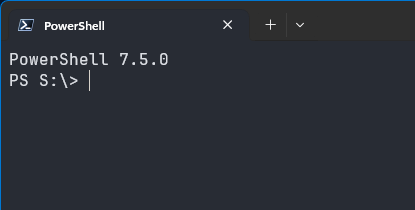

# wifistr

A Windows console application that continuously displays the signal strength of the connected Wi-Fi adapter.  No script engine required, no confusing GUI to navigate.  Just constant, no nonsense feedback while you position your ~~wire coathanger~~ *antenna* for best possible reception.



## Requirements  
- **Windows 10 and 11** (tested and confirmed working).
- **Windows Vista, 7, 8, and 8.1** (theoretically supported; WLAN API was introduced in Vista).

## Instructions

1. **Clone the repo:**
    ```powershell
    git clone https://github.com/ljredux/wifistr.git
    ```

2. **Install a GCC compiler and MinGW-w64 (I use [winlibs_mingw](https://github.com/brechtsanders/winlibs_mingw)):**
    ```powershell
    winget install BrechtSanders.WinLibs.POSIX.UCRT
    ```

3. **Compile:**
    ```powershell
    gcc wifistr.c -o wifistr.exe -lwlanapi
    ```
    Alternatively, for a smaller exe:
    ```powershell
    gcc wifistr.c -o wifistr.exe -lwlanapi -s -O2 -fno-asynchronous-unwind-tables -ffunction-sections -fdata-sections "-Wl,--gc-sections"
    ```
    
Alternatively you can use the Makefile, but your MinGW installation paths (32bit and 64bit) must be defined at the top.

## License
This project is licensed under the MIT License - see the [LICENSE](LICENSE) file for details.